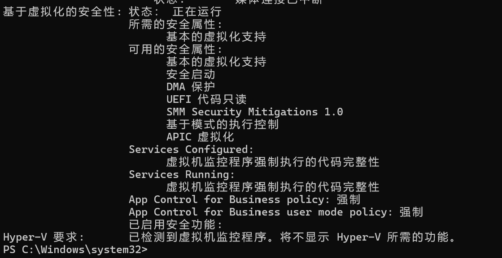

# WSL Troubleshooting Guide

This document summarizes common issues that may occur when installing or using **WSL 2, Ubuntu, and VS Code** on Windows.

If your issue is not covered in this document, please provide a **screenshot containing the complete error message** whenever possible and send it to the group chat, or contact the **Technical Department** directly.

When asking for help, please try to provide:

* Windows version
* The command you executed
* The complete error message
* Which step you were on when the problem occurred
* Output of `wsl --status` (if available)
* Output of `wsl --list --verbose` (if available)

---

## Before Troubleshooting: Am I in PowerShell or Ubuntu?

Some commands in this document need to be executed in **Windows PowerShell / Windows Terminal**, while others need to be executed inside **Ubuntu / WSL**.

A Windows PowerShell prompt usually looks like:

```text
PS C:\Users\username>
```

or:

```text
C:\Users\username>
```

A WSL / Ubuntu prompt usually looks like:

```text
username@computer:~$
```

For example:

```powershell
wsl --list --verbose
```

must be executed in **Windows PowerShell / Windows Terminal**.

Commands such as:

```bash
sudo apt update
```

must be executed inside **Ubuntu / WSL**.

---

## Case 1: Ubuntu Starts Directly as `root` and Does Not Ask Me to Create a Username and Password

Normally, when Ubuntu starts for the first time, it should ask you to create a username and password.

If Ubuntu starts directly and the terminal prompt looks like:

```text
root@computer:~#
```

then you are currently using the `root` user.

> **Warning**
>
> It is not recommended to use `root` as your default user for everyday development.

First, create a normal user:

```bash
adduser <username>
```

Replace `<username>` with the username you want to use.

For example:

```bash
adduser sherry
```

Then add the new user to the `sudo` group:

```bash
usermod -aG sudo <username>
```

For example:

```bash
usermod -aG sudo sherry
```

Exit WSL:

```bash
exit
```

Then, in **Windows PowerShell / Windows Terminal**, check the names of the Linux distributions currently installed:

```powershell
wsl --list --verbose
```

You may see something like:

```text
NAME            STATE           VERSION
Ubuntu-24.04    Stopped         2
```

Next, set the new user as the default user:

```powershell
wsl --manage Ubuntu-24.04 --set-default-user <username>
```

For example:

```powershell
wsl --manage Ubuntu-24.04 --set-default-user sherry
```

Then enter WSL again:

```powershell
wsl
```

If the terminal prompt changes to:

```text
sherry@computer:~$
```

then the default user has been changed successfully.

If your system does not support `wsl --manage`, please ask for help before changing other settings.

---

## Case 2: Why Does Nothing Appear When I Type My Password?

This is normal behavior in Linux terminals.

When entering a password:

* The password itself will not be displayed
* `*` characters will not be displayed
* The cursor may appear not to move at all

For example, after running:

```bash
sudo apt update
```

you may see:

```text
[sudo] password for username:
```

At this point, simply type your password normally and press Enter.

> **Note**
>
> Even if no characters appear on the screen, your keyboard input is still being received.

If you think you entered the wrong password, you can usually press:

```text
Ctrl + C
```

to cancel the current command and try again.

---

## Case 3: Error Code `0x800701bc` or an Error Containing `https://aka.ms/wsl2kernel`

You may see an error similar to:

```text
WslRegisterDistribution failed with error: 0x800701bc
```

or the error message may contain:

```text
https://aka.ms/wsl2kernel
```

This usually means that the WSL 2 Linux Kernel Update Package is missing.

Download and install the WSL kernel update package, then start WSL again.

You can also refer to Microsoft's official WSL 2 kernel update instructions:

```text
https://learn.microsoft.com/windows/wsl/install-manual
```

After installation, try:

```powershell
wsl
```

again.

---

## Case 4: Windows Says Virtualization Is Disabled, or “Virtual Machine Platform” Cannot Be Found / Enabled

Search for the following in the Start menu:

```text
Turn Windows features on or off
```

On a Chinese Windows system, it is usually displayed as:

```text
启用或关闭 Windows 功能
```

WSL 2 requires the following features:

```text
Virtual Machine Platform
Windows Subsystem for Linux
```

On a Chinese Windows system, `Virtual Machine Platform` is usually displayed as:

```text
虚拟机平台
```

If you can find these options normally, enable them and restart your computer.

You can also enable `Virtual Machine Platform` using PowerShell with administrator privileges:

```powershell
dism.exe /online /enable-feature /featurename:VirtualMachinePlatform /all /norestart
```

If you **cannot find `Virtual Machine Platform` in Windows Features, or cannot enable it**, continue by checking hardware virtualization.

First, run the following command in Windows PowerShell:

```powershell
systeminfo
```

Check whether the system information shows that hardware virtualization is enabled.

If hardware virtualization is not enabled, you may need to enter BIOS / UEFI and enable Virtualization.

The option may have different names on different computers, such as:

```text
Intel Virtualization Technology
VT-x
AMD-V
SVM Mode
```

Set the corresponding virtualization option to:

```text
Enabled
```

Save the settings and restart Windows.

If you are not sure how to enter BIOS / UEFI, refer to Microsoft's official documentation on Windows virtualization settings, or send your computer model and a screenshot of the issue to the group chat for help.

---

## Case 5: “Catastrophic Failure” / “灾难性故障”

This issue may be caused by a corrupted WSL installation.

Try the following methods in order.

### Choice A: Update WSL

Open **Windows PowerShell** and run:

```powershell
wsl --shutdown
wsl --update
```

Then try starting WSL again:

```powershell
wsl
```

### Choice B: Disable and Re-enable WSL Features

Open **Windows PowerShell as Administrator**.

Disable WSL and Virtual Machine Platform:

```powershell
Disable-WindowsOptionalFeature -Online -FeatureName "Microsoft-Windows-Subsystem-Linux" -NoRestart
Disable-WindowsOptionalFeature -Online -FeatureName "VirtualMachinePlatform" -NoRestart
```

Restart your computer.

Then open PowerShell as Administrator again and re-enable both features:

```powershell
dism.exe /online /enable-feature /featurename:Microsoft-Windows-Subsystem-Linux /all /norestart
dism.exe /online /enable-feature /featurename:VirtualMachinePlatform /all /norestart
```

Restart your computer again.

### Choice C: Reinstall WSL Using the Installer

Download and run the WSL installer again.

If you are using the offline installation method provided in the Workshop, follow the WSL Installer steps in the main installation document again.

### Choice D: Reinstall the WSL App Package

Open PowerShell as Administrator:

```powershell
Get-AppxPackage MicrosoftCorporationII.WindowsSubsystemforLinux -AllUsers | Remove-AppxPackage
```

Then reinstall / update WSL:

```powershell
wsl --update --web-download
```

After installation, restart Windows if necessary.

---

## Case 6: Error Code `0x80370114`

If you encounter:

```text
WslRegisterDistribution failed with error: 0x80370114
```

you can try disabling **Windows Hypervisor Platform**.

Open PowerShell as Administrator:

```powershell
Disable-WindowsOptionalFeature -Online -FeatureName "HypervisorPlatform" -NoRestart
```

Then restart your computer.

Alternatively:

1. Open `Turn Windows features on or off`
2. Find:

```text
Windows Hypervisor Platform
```

3. Uncheck it
4. Restart Windows

---

## Case 7: Error Code `0x8007019e`

If you see:

```text
WslRegisterDistribution failed with error: 0x8007019e
```

try the following methods in order.

### Choice A: Set WSL 2 as the Default Version

Run the following command in Windows PowerShell:

```powershell
wsl --set-default-version 2
```

Then try starting Ubuntu again.

### Choice B: Update WSL

```powershell
wsl --update
```

Then restart WSL:

```powershell
wsl --shutdown
wsl
```

### Choice C: Check WSL and Virtualization Features

Make sure the following features are enabled:

```text
Windows Subsystem for Linux
Virtual Machine Platform
```

Restart Windows after making changes.

---

## Case 8: Ubuntu Files Cannot Be Found, or Ubuntu Closes Immediately After Opening

If Ubuntu reports that required files cannot be found, or closes immediately after opening, there may be a problem with the Ubuntu installation or its file path.

Even if Ubuntu cannot open normally, you can still troubleshoot directly using **Windows PowerShell / Windows Terminal**.

First, check the installed distributions:

```powershell
wsl --list --verbose
```

For example:

```text
NAME            STATE           VERSION
Ubuntu-24.04    Stopped         2
```

If Ubuntu is still listed, first try:

```powershell
wsl --shutdown
```

Then explicitly start Ubuntu:

```powershell
wsl -d Ubuntu
```

or, depending on the name of your distribution:

```powershell
wsl -d Ubuntu-24.04
```

If Ubuntu still does not work and you are sure that you need to reinstall it, you can unregister the distribution.

First, confirm the exact distribution name again:

```powershell
wsl --list --verbose
```

Then run:

```powershell
wsl --unregister Ubuntu-24.04
```

> **Warning**
>
> `wsl --unregister` permanently deletes all Linux files, installed software, user accounts, and configuration inside that distribution.
>
> Do not run this command if there are important files inside the distribution that have not been backed up.

After unregistering the damaged distribution, reinstall Ubuntu.

---

## Case 9: Windows Does Not Recognize the `wsl` Command

If PowerShell reports that:

```text
wsl
```

is not recognized as a command, first make sure you are using the normal 64-bit **Windows PowerShell**, rather than:

```text
Windows PowerShell (x86)
```

If the window title contains:

```text
(x86)
```

close it and open the normal Windows PowerShell from the Start menu.

Then try:

```powershell
wsl --help
wsl --status
```

If WSL is not installed, try:

```powershell
winget install Microsoft.WSL
```

If further troubleshooting is required, open PowerShell as Administrator and enable the required Windows features:

```powershell
dism.exe /online /enable-feature /featurename:Microsoft-Windows-Subsystem-Linux /all /norestart
dism.exe /online /enable-feature /featurename:VirtualMachinePlatform /all /norestart
```

Then restart Windows.

After restarting, install Ubuntu:

```powershell
wsl --install -d Ubuntu
```

Check the installation result:

```powershell
wsl -l -v
```

Normally, Ubuntu should now appear in the list.

---

## Case 10: Linux Command Shows `command not found`

If you see:

```text
command not found
```

inside Ubuntu, first check the command itself.

Make sure:

1. The command is spelled correctly
2. Spaces are placed correctly
3. `-` is the standard English half-width hyphen

For example:

```bash
ls -l
```

is correct.

Its structure is:

```text
ls + space + -l
```

The following is incorrect:

```text
ls-l
```

If the command is spelled correctly, the required package may not be installed.

First update the package list:

```bash
sudo apt update
```

Then install the required package:

```bash
sudo apt install <package>
```

---

## Case 11: Do I Need to Install Ubuntu, Debian, and Arch? How Do I Check and Start a Distribution?

No. You do not need to install all of them.

Ubuntu, Debian, and Arch are different Linux distributions. You only need to install **one of them**.

For beginners in this Workshop, we recommend:

```text
Ubuntu 24.04 LTS
```

To check which Linux distributions are currently installed, run the following command in Windows PowerShell:

```powershell
wsl --list --verbose
```

or:

```powershell
wsl -l -v
```

For example:

```text
NAME             STATE           VERSION
* Ubuntu-24.04   Running         2
```

Here:

* `*` indicates the default distribution
* `VERSION` showing `2` means that WSL 2 is currently being used

To enter the default Linux distribution:

```powershell
wsl
```

To start a specific distribution:

```powershell
wsl -d Ubuntu-24.04
```

Replace `Ubuntu-24.04` with the actual name shown by:

```powershell
wsl --list --verbose
```

To exit WSL:

```bash
exit
```

You will then return to PowerShell or CMD.

---

## Case 12: Why Does WSL Start in `/mnt/c/Users/...`? Where Is `~` in Linux?

If you run:

```powershell
wsl
```

from PowerShell or CMD while your current Windows directory is:

```text
C:\Users\username
```

then WSL may start in the corresponding mounted Windows directory:

```text
/mnt/c/Users/username
```

This is normal.

To return to your Linux user's home directory, run:

```bash
cd ~
```

Check the current directory:

```bash
pwd
```

You should see something similar to:

```text
/home/username
```

In Linux, `~` represents the current user's home directory.

For example, if your username is:

```text
sherry
```

then:

```text
~
```

usually means:

```text
/home/sherry
```

You can confirm this using:

```bash
echo ~
```

or:

```bash
cd ~
pwd
```

To open the current WSL directory in Windows File Explorer:

```bash
explorer.exe .
```

You can also enter the following in Windows File Explorer:

```text
\\wsl$\
```

For example:

```text
\\wsl$\Ubuntu-24.04\home\sherry
```

The distribution name may be different on different computers. Use:

```powershell
wsl --list --verbose
```

to confirm the actual name.

For Linux development projects, it is recommended to store your projects inside the Linux home directory, for example:

```bash
mkdir -p ~/code
cd ~/code
```

---

## Case 13: VS Code Cannot Be Opened from WSL, or VS Code Is Not Connected to WSL

VS Code should be installed on **Windows**, while compilers and development tools should run inside WSL.

First, check whether VS Code is installed by running the following command in Windows PowerShell:

```powershell
code --version
```

If you have just installed VS Code and PowerShell reports that `code` cannot be found, close all PowerShell windows and reopen PowerShell.

Then enter WSL:

```powershell
wsl
```

Inside WSL, enter your project directory:

```bash
cd ~/code
```

Run:

```bash
code .
```

The first time you run this command, VS Code may automatically install **VS Code Server** inside WSL.

Wait for the installation to finish.

Then check the bottom-left corner of VS Code. You should see something similar to:

```text
WSL: Ubuntu
```

If you do not see this, install Microsoft's WSL extension.

Open the Extensions panel:

```text
Ctrl + Shift + X
```

Search for:

```text
WSL
```

and install the WSL extension provided by Microsoft.

You can also run the following command in Windows PowerShell:

```powershell
code --install-extension ms-vscode-remote.remote-wsl
```

After installation, enter WSL again and run:

```bash
code .
```

If you see:

```text
WSL: Ubuntu
```

then VS Code has successfully connected to the WSL environment.

---

## Case 14: VS Code Opens Normally, but GCC / G++ Does Not Work

Make sure GCC and G++ are installed **inside WSL**, rather than only on Windows.

First, enter WSL:

```powershell
wsl
```

Then run:

```bash
sudo apt update
sudo apt install build-essential gdb
```

Check the installation:

```bash
gcc --version
g++ --version
gdb --version
```

If the version information is displayed, the tools have been installed successfully.

> **Important**
>
> In this Workshop, GCC, G++, Make, and GDB should all run inside WSL.

---

## Case 15: WSL Shows a `localhost` Proxy Warning

You may see something similar to:

```text
wsl: Detected localhost proxy configuration, but it is not mirrored into WSL.
NAT mode WSL does not support localhost proxies.
```

This means that Windows currently has a proxy configured using `localhost`, while WSL is using NAT networking mode.

If WSL can still access the Internet normally, and commands such as:

```bash
sudo apt update
```

work correctly, then this warning can usually be ignored for this Workshop.

If WSL cannot access the Internet, include this warning when asking for help.

---

## Case 16: Basic Commands for Collecting Troubleshooting Information

If you are not sure where the problem is, first open **Windows PowerShell** and run:

```powershell
wsl --status
```

Then run:

```powershell
wsl --list --verbose
```

You can also check Windows system information:

```powershell
systeminfo
```



If WSL can start normally, enter Ubuntu:

```powershell
wsl
```

Then run:

```bash
whoami
pwd
```

These commands can help confirm:

* Your current Windows / WSL configuration
* Which Linux distributions are installed
* Whether you are currently using WSL 1 or WSL 2
* The current Linux user
* The directory WSL starts in

---

## If None of the Above Applies

If the methods above do not solve your problem, please provide the following information whenever possible:

```text
1. A screenshot showing the complete error message
2. Output of wsl --status
3. Output of wsl --list --verbose
4. Windows version
5. The command you executed before the problem occurred
6. A brief description of what you were trying to do
```

Then send this information to the group chat or contact the **Technical Department** directly.

If you need to search for solutions online yourself, prioritize reliable technical resources such as:

* Microsoft Learn
* Official Microsoft WSL documentation
* GitHub Issues
* Stack Overflow

> **Note**
>
> If you do not understand what a command does, or if you have not backed up important files, do not randomly execute commands such as `wsl --unregister` that can delete data from a WSL distribution.
