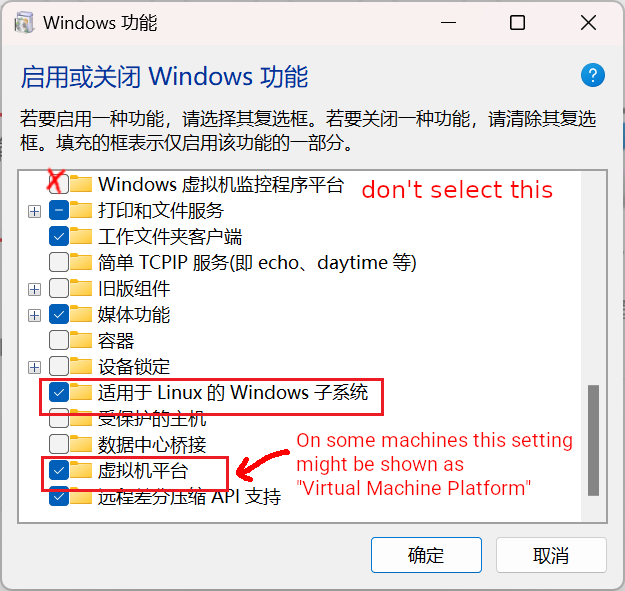
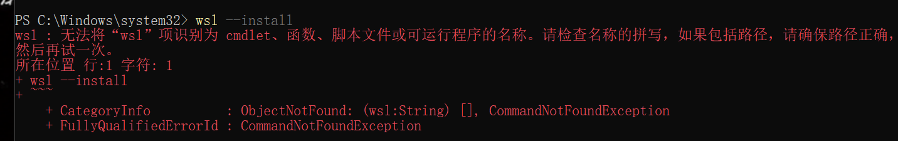
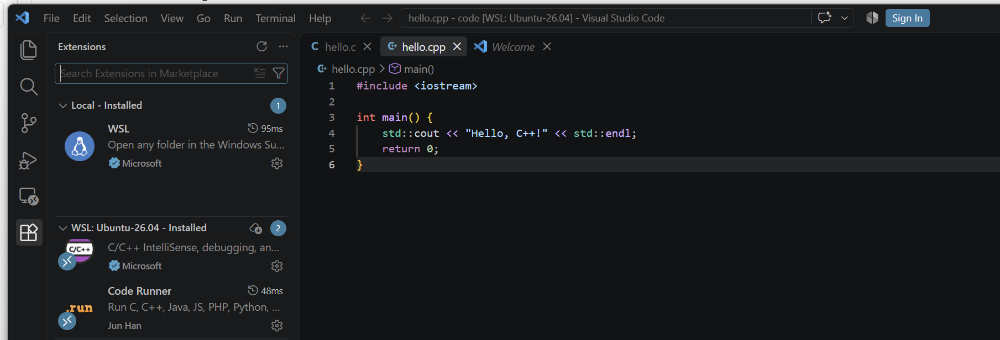

# WSL Install Guide

> This document is adapted from the original version by the 20th TechGC department.
>
> This document largely referred to [the official WSL installation documentation](https://learn.microsoft.com/en-us/windows/wsl/install) and [the manual installation documentation](https://learn.microsoft.com/en-us/windows/wsl/install-manual) provided by Microsoft.
>
> If you have any difficulty in reading this document in plain English, translate it using AI.

In this document, we\'re gonna go through the steps for installing Windows Subsystem for Linux, version 2, i.e. WSL 2.

## Preliminary Explanations

### What is a CLI?

The majority of computer users work with **GUI**, or **Graphical User Interface**. This requires you to use mouse to navigate the UI, e.g. double-clicking on a folder to open it.

In contrast, **CLI**, or **Command-Line Interface**, is a way to interact with your computer by **typing commands** instead of clicking buttons and menus. You can typically achieve the same or more with CLI.

For example, these are some CLI commands:

In Windows PowerShell:

```pwsh {title="Windows PowerShell"}
wsl --status
```
Inside Ubuntu / WSL:

```pwsh {title="WSL"}
sudo apt update
```

Here's a graph that might help you understand the difference between the two.


### What is WSL

WSL is a feature in Windows that lets you run a virtual machine for Linux directly on your Windows, as if you were on an Ubuntu, Debian, or other Linux computer. The greatest advantage is that it allows you to run Linux and Windows simultaneously.

### Why Linux is a better OS for development

For developers, its powerful commandline interface, package managers (like `apt`), customizable environment are primary draws. It streamlines software installation, scripting, and automation.

What\'s more, in ENGR1010J/1510J _Introduction to Computers & Programming_, JOJ (i.e. JOJ Online Judge) is used to test and grade your code, which is run within a Linux environment. So if you use Windows, you may encounter situations like: \"It works on my computer! Why can\'t it work in JOJ?\"

### Linux Distro

WSL is only an environment. You have to install a Linux distro (e.g. Ubuntu, Debian, Arch) as well. Linux is just a kernel, which serves as a base for operating systems. A Linux distro is an actual operating system based on the Linux kernel with the necessities you need for a working system.

### CPU Architecture

Your computer\'s CPU speaks a certain language called CPU architecture. The main architectures nowadays are **x64 (aka. amd64), arm64 (aka. aarch64), and RISC-V**, and they are **not compatible with each other**, i.e. software built for one won\'t run on another. So before downloading any software, check your CPU architecture or it won\'t work. Generally, the CPU designer determines its architecture:

- **Intel** and **AMD**: x64
- **Apple**, **Snapdragon**, and **Huawei**: arm64

## Installation

### Requirements (for WSL 2)

- For Windows 10: (Check \"Settings\" > \"System\" > \"About\")
  - For x64 systems: Version 1903 or later, with Build 18362.1049 or later.
  - For arm64 systems: Version 2004 or later, with Build 19041 or later.
- All versions of Windows 11 support WSL 2.

### Online Install

If you have some kind of way to access Microsoft Store or GitHub fast, then choose this method.

**TL;DR:** Install WSL 2 from Microsoft Store with Ubuntu is as simple as one command in your PowerShell (can be opened by searching \"Windows PowerShell\" in the Start Menu):

```pwsh {title="Windows PowerShell"}
wsl --install
```
{width=50%}

Alternatively, install Ubuntu from Microsoft Store, or add `--web-download` to download it from an online source:

```pwsh {title="Windows PowerShell"}
wsl --install -d Ubuntu [--web-download]
```

### Offline Install

If you don\'t have a steady connection to Microsoft Store or GitHub, then choose this method.

#### Step 1: Run WSL installer

Download from [this mirror on SJTU Pan](https://pan.sjtu.edu.cn/web/share/a873a19ff4cb5903469942925769f286), and run this installer.

::: caution
Only x64 versions are provided. If you have an arm-based Windows, go to [the official WSL release on GitHub](https://github.com/microsoft/WSL/releases/latest) to download an arm64 version.
:::

#### Step 2: Open PowerShell

Search in your Start Menu for \"Windows PowerShell\", and select \"Run as administrator\".

#### Step 3: Enable virtualization feature

Paste this line into PowerShell and run it.

```pwsh {title="Windows PowerShell"}
dism.exe /online /enable-feature /featurename:VirtualMachinePlatform /all /norestart
```

{width=50%}

#### Step 4: Restart your computer

Restart the system to apply the changes.

#### Step 5: Install Ubuntu

Download [the x64 Ubuntu installer from SJTU Pan](https://pan.sjtu.edu.cn/web/share/22b7ce9a2236b3e3aea2437a293954b9), then run it by double clicking on the downloaded file.

::: caution
Only an x64 Ubuntu installer is provided. If you have an arm-based Windows, go to [the official WSL release on GitHub](https://github.com/microsoft/WSL/releases/latest) to download an arm64 version.
:::

### Post-install Setup and create an Ubuntu user

After you complete your installation, WSL should automatically run. If it doesn\'t, open PowerShell and type `wsl`.

After you boot into WSL for the first time, the system would prompt you for a username and a password. Follow these steps:

1. Choose a username with **only lowercase letters and numbers**. The username does not need to be the same as your Windows username. Note that you can\'t use `root` as your username since it\'s reserved.
2. Type in any password with at least 6 characters of your choice. The password does not need to be the same as your Windows login password. Note that the password you entered **will not be shown on screen**. Don\'t panic and type normally if you see nothing appears. **Make sure to keep this password in mind as it will be used many times afterwards.**

{width=50%}

After setting up the username and password, you are good to go. Type `exit` to exit WSL.

## Troubleshooting

If you have any problem during the above installation steps, firstly refer to this section for help. If none of these cases apply, reach to any one of our team for in-person assistance.

### Case 1: Error with code 0x800701bc or Error with link \"https://aka.ms/wsl2kernel\" attatched

Go to [this mirror on SJTU Pan](https://pan.sjtu.edu.cn/web/share/6c95fbcb03dda858863ff7a64814844f) to download a patch and install it. Then start WSL again.

Alternatively, go to the provided <https://aka.ms/wsl2kernel> link to download.

### Case 2: Error telling you Hyper-V is not enabled

Search for \"Turn Windows features on or off\" (启用或关闭Windows功能) in Start Menu and open it. Find \"Hyper-V\" and tick all boxes. Then restart your PC and start WSL again.

{width=50%}

Alternatively, if you failed to find \"Turn Windows features on or off\" in the Start Menu, go to \"Control Panel\" > \"Programs\" > \"Turn Windows features on or off\", and continue as stated above.

#### Case 2.1: No Hyper-V Settings {#case-2-1}

You should check whether your PC supports WSL 2. See the above section [Requirements (for WSL 2)](#requirements-for-wsl-2).

#### Case 2.2: Some of the settings can\'t be ticked

This might be an issue with your hardware. Please refer to section \"How to Enable Hardware Virtualization in BIOS\" in [this blog post](https://www.makeuseof.com/windows-11-enable-hyper-v/) and try to enable hardware virtualization.

### Case 3: Error telling you \"Catastrophic failure\" (灾难性故障)

This error may be due to corruptions during wsl installation. A reinstall may work.

You can try one of the following fixes:

- **Choice A:** Directly fix through `wsl` command.

```pwsh {title="Windows PowerShell"}
wsl --update
```

- **Choice B:** Disable and re-enable WSL.

1. Disable WSL and Virtualization in PowerShell:

```pwsh {title="Windows PowerShell"}
Disable-WindowsOptionalFeature -Online -FeatureName "Microsoft-Windows-Subsystem-Linux" -NoRestart
Disable-WindowsOptionalFeature -Online -FeatureName "VirtualMachinePlatform" -NoRestart
```

1. Restart your computer.

2. Re-enable these two features:

```pwsh {title="Windows PowerShell"}
dism.exe /online /enable-feature /featurename:Microsoft-Windows-Subsystem-Linux /all /norestart
dism.exe /online /enable-feature /featurename:VirtualMachinePlatform /all /norestart
```

- **Choice C:** Fix through WSL installer.

Perform [the offline install \"Step 1\"](#step-1-run-wsl-installer) stated before.

- **Choice D:** Use Appx system to reinstall.

1. Remove the WSL AppxPackage:

```pwsh {title="Windows PowerShell"}
Get-AppxPackage MicrosoftCorporationII.WindowsSubsystemforLinux -AllUsers | Remove-AppxPackage
```

1. Reinstall WSL as AppxPackage through the `wsl` command:

```pwsh {title="Windows PowerShell"}
wsl --update --web-download
```

### Case 4: Error with code 0x80370114

Run this command in PowerShell to disable \"Windows Hypervisor Platform\":

```pwsh {title="Windows PowerShell"}
Disable-WindowsOptionalFeature -Online -FeatureName "HypervisorPlatform" -NoRestart
```

Then restart your computer.

Alternatively, go to \"Turn Windows features on or off\" (启用或关闭 Windows 功能) and unselect \"Windows Hypervisor Platform\" (Windows 虚拟机监控程序平台). Then restart your computer.

{width=50%}

### Case 5: Error with code 0x8007019e

You could try one of the following fixes:

- **Choice A:** Explicitly set the default version of WSL.

```pwsh {title="Windows PowerShell"}
wsl --set-default-version 2
```

- **Choice B:** Fix through `wsl` directly.

```pwsh {title="Windows PowerShell"}
wsl --update
```

- **Choice C:** Try [the solution to Case 2.1](#case-2-1).

### Case 6: Ubuntu files not found

{width=50%}

This may be due to changes of the path of Ubuntu files. Try uninstall Ubuntu by:

```pwsh {title="Windows PowerShell"}
wsl --unregister Ubuntu
```

And reinstall Ubuntu by following the install instructions.

### Case 7: `wsl` command not found

Install `wsl` with `winget`:

```pwsh {title="Windows PowerShell"}
winget install Microsoft.WSL
```
If PowerShell reports that `wsl` is not recognized as a cmdlet, function, script file, or executable program


#### Case 7.1: `wsl` command not found in Windows PowerShell (x86)
First check whether you opened **Windows PowerShell (x86)**.


If the window title contains **`(x86)`**, you are running the 32-bit version of PowerShell. On a 64-bit Windows system, this may prevent PowerShell from finding the normal `wsl.exe`.

Close the current window and open the normal **Windows PowerShell** (without `(x86)`) from the Start Menu, preferably using **Run as administrator**.

Then check whether WSL is available:

```pwsh {title="Windows PowerShell"}
wsl --help
wsl --status
```
#### Case 7.2: `wsl` command not found in Windows PowerShell

If WSL has actually been removed or you want to reinstall it, open the normal **Windows PowerShell as administrator** and enable the required Windows features:

```pwsh {title="Windows PowerShell"}
dism.exe /online /enable-feature /featurename:Microsoft-Windows-Subsystem-Linux /all /norestart
dism.exe /online /enable-feature /featurename:VirtualMachinePlatform /all /norestart
```

Then **restart Windows**.

After restarting, open the normal Windows PowerShell again and install Ubuntu:

```pwsh {title="Windows PowerShell"}
wsl --install -d Ubuntu
```

After installation, check the installed distributions with:

```pwsh {title="Windows PowerShell"}
wsl -l -v
```

If the installation succeeds, you should see Ubuntu listed and WSL version 2 enabled.

### None of these cases apply

See troubleshooting.md for further information.

Search on Google or ask AI with the error message on your screen for help.

If you are checking web resources, it is highly recommended to go to professional websites and forums like StackOverflow, Microsoft Doc, or GitHub issues.

## VS Code Setup

After setting up WSL, we recommend using **Visual Studio Code (VS Code)** as the editor for programming.

In this workshop, **VS Code is installed on Windows**, while your source code, compiler, debugger, and other development tools **run inside WSL**.

### Step 1: Install Visual Studio Code

Open **Windows PowerShell** and run:

```pwsh {title="Windows PowerShell"}
winget install -e --id Microsoft.VisualStudioCode
```

::: note
If you find this step to be pretty time-consuming, press `Ctrl-C` to terminate the process and follow the steps at [CERNET mirrors](https://help.mirrors.cernet.edu.cn/winget-source/) to setup a mirror for your winget.

:::

Alternatively, you can download and install Visual Studio Code from [its official website](https://code.visualstudio.com/).

After installation, close and reopen PowerShell.

Check whether the `code` command is available:

```pwsh {title="Windows PowerShell"}
code --version
```

If a version number is displayed, VS Code has been installed successfully.

::: note
If PowerShell reports that `code` cannot be found immediately after installation, close all PowerShell windows and open PowerShell again.

This allows Windows to reload the updated `PATH`.
:::

### Step 2: Install the WSL Extension

Open Visual Studio Code.

Go to the **Extensions** panel on the left sidebar, or press `Ctrl + Shift + X`. Then search for `WSL`, and Install the **WSL** extension provided by Microsoft.

Alternatively, you can install it directly from Windows PowerShell:

```pwsh {title="Windows PowerShell"}
code --install-extension ms-vscode-remote.remote-wsl
```

The WSL extension allows the Windows version of VS Code to open folders, run terminals, and use development tools inside WSL.

### Step 3: Install C/C++ Development Tools in WSL

Enter WSL:

```pwsh {title="Windows PowerShell"}
wsl
```

You should now see a Linux prompt similar to:

```text
username@computer:~$
```

Update the package list:

```bash {title="WSL"}
sudo apt update
```

::: note
If you find this step to be pretty time-consuming, press `Ctrl-C` to terminate the process and follow the steps at [CERNET mirrors](https://help.mirrors.cernet.edu.cn/ubuntu/) to setup a mirror for your Ubuntu distro.

:::

Then install the basic C/C++ development tools:

```bash {title="WSL"}
sudo apt install build-essential gdb
```

`build-essential` includes commonly used development tools such as:

- `gcc` for compiling C programs
- `g++` for compiling C++ programs
- `make` for building projects

`gdb` is the debugger that we will use later with VS Code.

Check whether they are installed correctly:

```bash {title="WSL"}
gcc --version
g++ --version
gdb --version
```

If version information is displayed, the installation is successful.

::: important
In this workshop, GCC and GDB are installed **inside WSL**, not on Windows.

:::

### Step 4: Open a WSL Folder in VS Code

We recommend storing Linux development projects inside your WSL home directory.

Create a folder for your code:

```bash {title="WSL"}
mkdir -p ~/code
cd ~/code
```

Open this folder with VS Code:

```bash {title="WSL"}
code .
```

The first time you run this command, VS Code may automatically install **VS Code Server** inside WSL. Wait for the installation to finish.

A new VS Code window should open.

Check the bottom-left corner of VS Code. You should see something similar to:

```text
WSL: Ubuntu
```

This means VS Code is now connected to your WSL environment.

::: important
Seeing `WSL: Ubuntu` in the bottom-left corner is important.

It means that although the VS Code interface is running on Windows, commands such as `gcc`, `g++`, `gdb`, and the integrated terminal are running inside Ubuntu.
:::

### Step 5: Install the C/C++ Extension

While VS Code is connected to WSL, open the **Extensions** panel:

```text
Ctrl + Shift + X
```

Search for:

```text
C/C++
```

Install **C/C++** provided by Microsoft.



If VS Code asks whether to install the extension in Windows or WSL, make sure it is also installed in:

```text
WSL: Ubuntu
```

This extension provides features such as:

- code completion
- syntax checking
- debugging
- breakpoint support
- integration with GDB

### Step 6: Test the Environment

Create a file named:

```text
hello.c
```

and write:

```c {title="C"}
#include <stdio.h>

int main(void) {
    printf("Hello, C!\n");
    return 0;
}
```

Open the integrated terminal in VS Code by pressing:

```text
Ctrl + `
```

The terminal prompt should look similar to:

```text
username@computer:~/code$
```


Compile the program:

```bash
gcc hello.c -o hello
```

This command uses **GCC (GNU Compiler Collection)** to compile the C source file into an executable program.

The command can be understood as:

```text
gcc hello.c -o hello
│   │       │  │
│   │       │  └── Output file name
│   │       └───── -o means "output"
│   └───────────── Input C source file
└───────────────── GCC compiler
```


Run it:

```bash
./hello
```

You should sHere:

```text
.
```

means the current directory that **hello.c** is put in.

Therefore:

```bash
./hello
```

means:

Run the executable file named `hello` located in the current directory.

Linux then loads the program into memory and starts executing it from the `main()` function.

If you see output like:

```text
Hello, C!
```

Congratulations! You now have a working C/C++ development environment using **VS Code + WSL + GCC**.

## Future Development

If you want to learn more about how to code in vscode and writing markdown files, please look forward to our Vscode and Markdown Workshops held by Tech-GC~